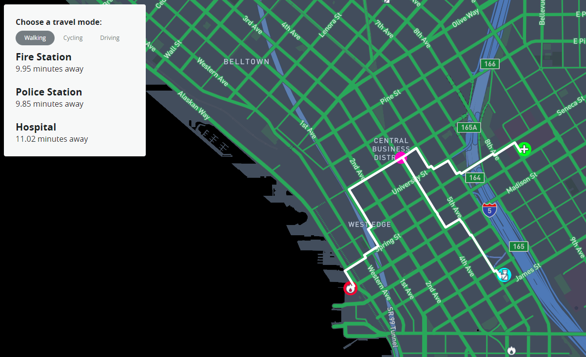
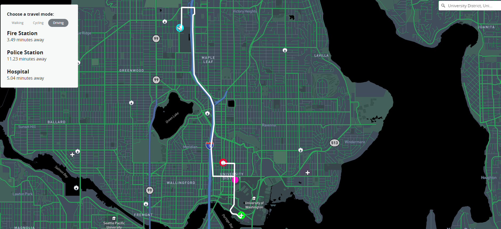

# Closest Emergency Personel

## Description

What this project does is takes a user's search or click and highlights the closest police station, fire station, and hospital as well as their fastest routes to each along with estimated travel times for the given mode of transportation that's chosen. In terms of inspiration for the project, emergency personel wasn't my first choice however I am definitely glad that this is where it ended up. Originally I wanted to map homeless shelters and food banks but that type of data was harder to track down.

In one of my previous courses I had worked with crime, covid, and fire data and that culmination got me thinking about emergency personel. So I poked around [data.seattle.gov](https://data.seattle.gov/) a bit to see if they had data on police stations, fire stations, and hospitals, to which they did. Since the data was there, along with a loose idea, I decided to run with it and build the project around the data.

At first I wasn't entirely sure which template from the last few weeks I wanted to use. Each individual one didn't feel strong enough on its own, but the nearest neighbor example with the library and hospitals ended up being the first template to be implemented. The difference between this project and the example was that each of my emergency personel types are locations that I want to find, not use to click on to find the other two.

At this point I decided to implement the geocoder template so that way the user can search for a location and the application can find the closest of each emergeny personel. Implementing that was a little tedious because I had to use the console to figure out what information I have to work with in terms of the resulting data from the search event. Then I had to figure out how to pull out the necessary data that would mimic the data from clicking on the map that we saw in the example.

This still didn't feel like a strong enough application to call a final project. I ended up adding the same nearest neighbor functionality to clicking so as to give the user full range to interact with the map. By this point in the development process I knew that this application would benefit tremendously from drawing out routes to each of the nearest emergency personel locations. Since routes weren't included in our covered templates, I decided to poke around Mapbox and very quickly found the Directions API which was an absolute blessing.

With all of the templates and functions that I had up to this point, implementing the Directions API was a breeze. I really just plugged in location coordinates and the api did the rest because the data that comes back includes coordinates for the whole route which just get thrown into a map layer, and the data also includes other information such as travel time which was a simple thing to display to the user. Now the user not only gets to see the closest of each emergency personel, but also gets the route to them and the time it would take in minutes to reach them.

## Goal

The goal of this project is to provide a visual idea of where emergency personel is and how close/spread out they are if something were to happen. An interesting usecase for this application could include finding areas that are underserved by comparing travel times to get help of any kind. City government officials might want to consider filling in spatial gaps in aid because seconds and minutes matter in a lot of cases when any of the observed emergency personel are involved.

## Application Link

https://vaneraklan.github.io/ClosestEmergencyPersonel/index.html

## Screenshots

Here is a screenshot of the application in action! This one is from a click event which doesn't look much different from the search event.

For parity sake, here is a screenshot of the application functioning from a user's search result. In this case the search was for University District (see the top right, it's kinda small)

## Main Functions

#### *geojsonFetch(...)*

This is probably the meat of the application since so much happens inside of it. It's loading the data, filling in the map, and setting up all of the event listeners for when user interaction occurs.

#### *nearbyPersonel(...)*

Second in command, this funcion finds the nearest of each of the emergency personels and highlights them. From there, information is passed to *getRoute()*

#### *getRoute(...)*

This highlights the fastest routes to each of the three closest emergency personels for the selected mode of transportation as well as gives the estimated travel time to each of them.

#### *turf.nearest(...)*

Finds the nearest emergency personel(s)

#### *geocoder.on('result', ...)* & *map.on('click', ...)*

These are the interactive pieces of the application. Whenever someone searches a place/address, or clicks anywhere on the map a marker will be dropped at the target location and the functions for highlighting the nearest emergency personel locations and their routes + travel times will trigger.

## Data Sources

[Police Station Data](https://data.seattle.gov/dataset/Police-Stations/yfpf-qbei)

[Fire Station Data](https://data.seattle.gov/dataset/Fire-Stations/jamt-dvzr)

[Hospital Data](https://data.seattle.gov/dataset/Hospitals/x6vc-2g3e)

## Applied Libraries and Web Services

Mapbox GL

Turf

Directions API

Github

Mapbox Studio

## Other Informative Pieces

I think future research or iterations of something like this would benefit from a more thorough sidepanel. For instance, the Direction API provides directions for the routes it produces, so the directions to each of the closest emergency personel could be displayed. Also, providing phone numbers for the user to call might be useful in tight situations. Albeit, calling 911 should be the go-to in emergencies so having the direct line might not be necessary in those instances.

## Acknowledgemnts

Bo Zhao for being the professor for this cuorse and for providing an insightful quarter

Developers at Mapbox for their various tools and APIs that made the application possible

Those involved with City of Seattle data portal for their transparency and allowing such reliable and useful data to be, and continue to be, open for public use
